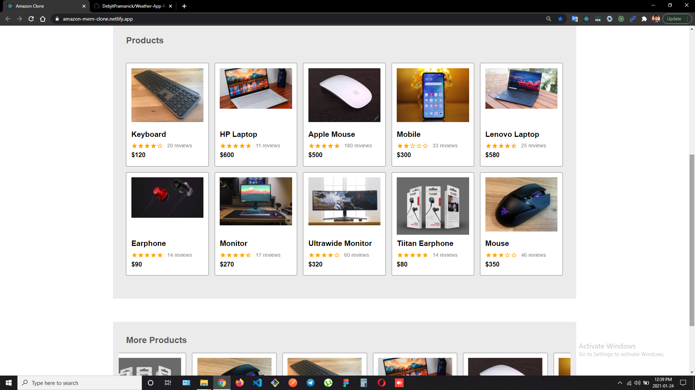
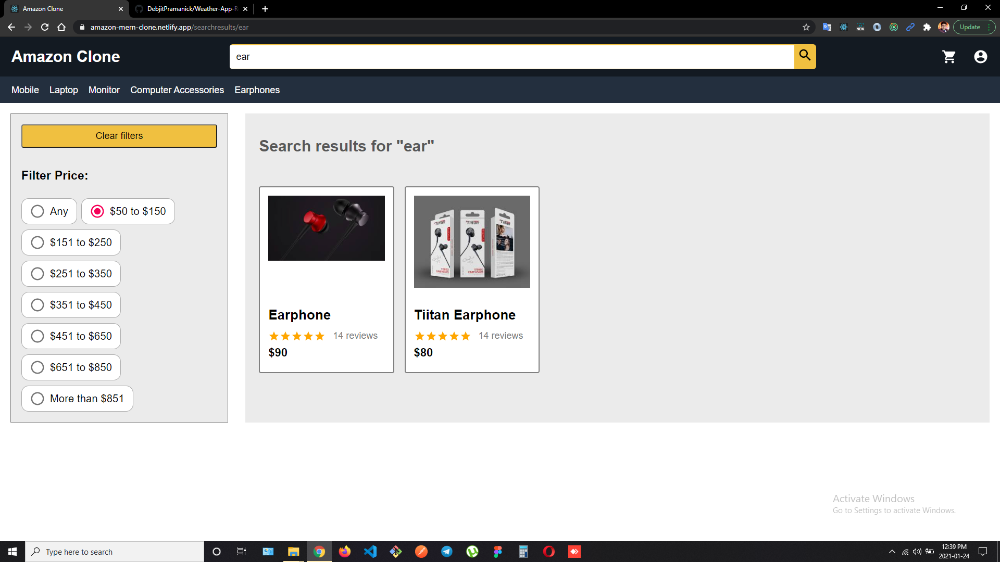
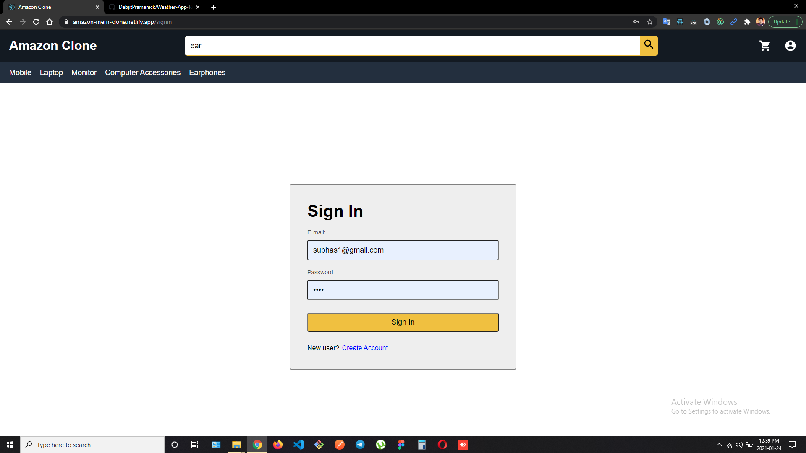
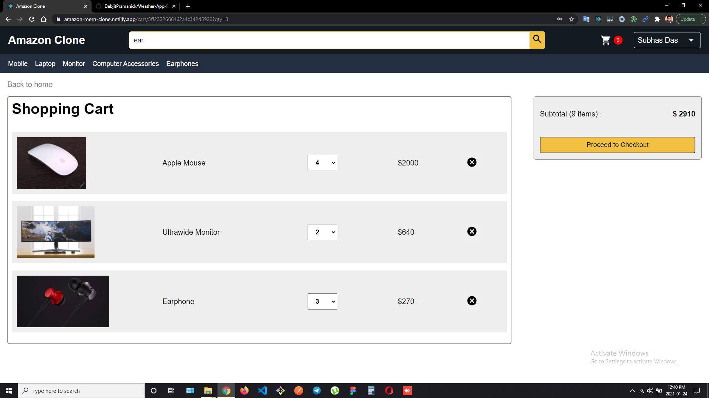

# AMAZON CLONE

Hi! I'm Sarthak Patel, a **MERN Stack Developer**. This is a clone of popular e-commmerce website and I have migrated the original on premise code to AWS. **Amazon**.
 
 
> ### Web App Link - [https://amazon-clone-eight-rho.vercel.app/](http://my-final-amazonclone-env.eba-q4spmvev.us-east-1.elasticbeanstalk.com/]

 

## Features

- Register or login as an user.
- Update user account.
- Search products.
- Apply filters for searching products.
- Add products to cart.
- Change the required number for products.
- Payment with PayPal.
- Create order.
- Check order history.

##  NPM Packages Used

- React-redux
- Material UI
- Express
- Nodemon
- Mongoose

## Screenshots

Login Credentials:
1. Email: admin2023@gmail.com
2. Pass: 1234

 

 

 

 

